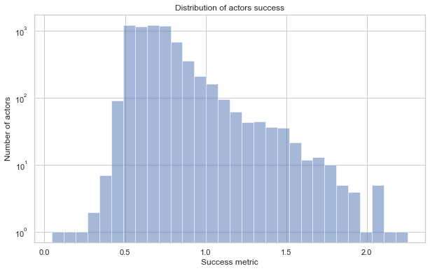

# The Actor's Playbook: 
# A Guide to Picking Roles for Hollywood Success

Are you an aspiring Hollywood actor? Have you ever wondered durign a casting if this role was truly meant for you? If so, you have come to the right place. For every actor, the path to success is paved with strategic choices. Every role you choose might launch your career or derail it completely. It becomes hence crucial to understand the effect of succession of roles on Hollywood actors success.
In this guide, we will explore the importance of role types (lead or secondary or essemble role) and how each can shape your future as an actor. Based on movie plot summaries and scripts, we will also uncover the significance of dialogues and screen time. The budget and financial scale of the movie projects are also aspects we will delve into.

So whether you're about to attend your first audition or looking to recalibrate your career trajectory as an actor, join us in our exploration.

## Get to know our data

To perform this analysis, a combination of different datasets were used, the first being the CMU Movie Summary Corpus. It consists of a collection of 42,306 movie plot summaries extracted from Wikipedia, a medatada of 81,741 movies and 450,669 character/actor duos extracted from Freebase. 
This data was merged with an additional movie and actor dataset from Tmdb website, providing supplementary information such as the movies budget, genres, vote count and vote average as well as movie and actor popularity. 

The main part of our analysis being Hollywood movies, the movie database was filtered to remove any movies whose first language was not English.

Furthemore, the actors dataset was also filtered to remove actors who have ended their career more than 20 years ago, in an attempt to keep the results are in line with actors of our generation. This guide should be relevent to the present industry landscape.

After this filtering, 6714 actors remain.

## How to represent the timeline of an actor's career ?

Our goal thoughout this analysis is to understand how each role played by an actor or the combination of those roles may have impacted his overall sucess and recognition. The definition of this success is explained later. The career trajectories and the distribution of role features are unique for each actor. As a result, it would be poor choice to solely base our analysis on the average of those features, such as the average genre, average movie budget or average role importance. Instead, we need to consider the evolution of those features in time to truly understand their impact on success. For this reason, we decided to divide the career of actors in 3 time spans: the Early Years, the Mid-Career and the Late Career.
The career of an actor extends from the release date of the first movie he played in to the last movie. We choose to define the Early Years of the career as the first 20 years. The following 20 years (between year 21 and 40) constitute the Mid-Career and every other movie released after that are part of the actor Late-Career stage.
The dataset can then be separated in 3: the young actors, still in their earlier years, the experienced actors in their Mid-Career and the very experienced actors in their Late-Career. During our analysis, we will consider those 3 career stages indepently.

The following plots show the career trajectory of 3 sampled actors: Zoe Lister-Jones, A.C Peterson and Jackie Chan. Each are in different stages of their career. The yellow range represents the Early years of the career, the orange the Mid-Career and the Red the Late-Career.

  <iframe src="assets/plots/traj_1.html" width="100%" height="300px"></iframe>

  <iframe src="assets/plots/traj_2.html" width="100%" height="300px"></iframe>

  <iframe src="assets/plots/traj_3.html" width="100%" height="300px"></iframe>

Red dots are movies in which the actor played a lead role, green dots a secondary role and black dot a smaller or ensemble role. Those categories were defined based on the portion of the movie in which the actor appeared. You'll find more explanations further down.

## How to measure an actor success?

### Popularity
An actor success is a tricky metric to discover, considering every actor has its own interpretation of success . 
The popularity of an actor as computed by TmdB fluctuates in time and is impacted by the number of views for the day as well as the previous day score. If we look at the metric sampled recently and plot it against the release date of an actor most recent movie, it is clear that more recent movies produce more popular actors. 

  

This can be related to the effect of trend.
To mitigate this effect, the actor popularity metric was normalized using a "within group" z-score normailzation. Each actor improved popularity score is relative to the mean and standard deviation of the scores of actors whose most recent movie was released in the same year range. You'll find below the distribution of the popularity metric post scaling.

  

Comparing both plots y-axis, we can observe a reduced gap between popularity of trendy and more dated actors. This now represents better the popularity an actor may have received in his career.

### Fame
To compliment this indicator, a second metric was added, published by YouGov. They provide nationally representative popularity scores.They define the fame of the 1500 most famous American actors, as the percentage of people in the United States who have heard of them. According to the Pew Research Center, their methodology "consistently outperformed" other online polling companies.  
This metric, by the way it was computed constitutes a more timeless representation of actor success, compared to popularity. However, since this measurement only applies to 1500 actors out of the 6835 in our filtered database, we chose to use Support Vector Regression (SVR) with polynomial, linear and rbf kernel to predict the fame of the remaining actors. This regression technique was trained on the   actors belonging to the Yougov dataset, to understand in what way all the actor features explain the Yougov fame metric. In a second testing phase, the fame was predicted on the rest of our actor data based on those very same features.

The features of actors, used to predict fame were the following: 
- career length
- number of movies
- gender
- TmdB scaled popularity
- average TmdB movie popularity in each stage of the actor career
- average and standard deviation of movie budget in each stage of the actor career
- average and standard deviation of role importance per movie in each stage of the actor career (called order_0 here)
- average and standard deviation of revenue per movie in each stage of the actor career
- average and standard deviation of ImdB rating per movie in each stage of the actor career

The box plots below show the importance of each feature in predicting this fame metric. Each plot corresponds to actors in certain stages of their career. 

  

After close inspection, some features seem to stand out. Career length, which can be considered as a measure of actor experience, is without any surprise an indicator of fame. A part from that, movie budget and role importance seem to also play a part. This will have to be investigated.

### Awards 

A part from the popularity indicators, an actor success can also be defined as the number of awards he or she has received. Consequently, we retrieved data from several organizations: the Oscars, the Golden Globe and the Critic's Choice, the idea being that a vast and varied amount of awards data would best represent the success of actors. The account of each award was aggregated using a weighted sum.
The Oscars, presented by the Academy of Motion Picture Arts and Sciences, are considered as the most prestigious awards an actor could receive and have been recognizing excellence in cinematic achievements ince 1929. We accounted for both the nominations and the wins.
The Golden Globe awards are presented by the Hollywood Foreign Press Association, and though they are highly regarded, they don't equal the prestige of the awards.
As for the Critic's Choice, the awards receivers are chosen by the the members of the Critic's Choice Association, which includes journalists and film critics. Those awards may not hold the same historical significance as the Oscars, yet they provide a broad perspective on the film industry and are known for recognizing achievements in movies. 

The formula defining the general awards metric is simply a weighted sum, with more weight attributed to the wins than for the nominations. The weights also mirror the prestige and significance of each award:

$$
\text{Awards} = 2 \cdot \text{oscar\_wins} + \text{oscar\_nomination} + 2 \cdot \text{cc\_act} + 2 \cdot \text{gg\_act} + \text{cc\_supp\_act} + \text{gg\_supp\_acc}
$$

where oscar_wins and oscar_nomination are the number of wins and nominations received by the Oscars, cc_act and gg_act are the number of Best-Actor Awards received from the Critic's Choice and Golden Globe respectively, all genres combined, and cc_supp_act and gg_sup_acc are the Best-Supporting Actors awards from the same organizations.

  

### Final success score:

The final success score is computed as follow:

$$
\text{Success} = \text{fame} + \text{popularity} + \sqrt{\text{awards}}
$$

It aims to be a representation of the cumulative success gained by an actor throughout his career. The weights on each factor are based on their perceived importance. The fame and popularity factors balance each other. The fame aims to be more representative of the overall recognition of an actor and is better isolated in time. However, this metric was available only for 30% of the actors. Thus, other techniques were used to predict it for the rest of the data, which introduces some uncertainty. On the other hand, the popularity extracted from TmdB is directly measured for all actors but even though it was scaled in time, this metric was shown to fluctuate and might be influenced by short term factors. By combining those two measures with the awards, the goal is to provide a comprehensive and nuanced measure of an actor success, which will be at the core of our analysis. The formula uses the square root of the weighted sum of awards. With this representation, we make sure that the difference between 0 and 1 award is emphasized. The impact diminishes as the number of awards increases. 
The plot below shows the distribution of the popularity metric for our Hollywood actor dataset.

  

Now that we have defined what success is, let's dive into our role analysis. We want to analyze the effect of three distinct features on the success score of Hollywood actors:
- Importance of the role/character in the movie
- Main genre of movies played by the actor
- Budget of the movies

We perform 3 independent analyses for each feature to help isolate their individual effect and understand their unique contribution. Separate analysis also makes it easier to interpret our results and to capture the potential interactions between the variables. This being said, let's dive in.

## Do lead roles contribute more to success compared to supporting roles??
 
Depending on your experience as an actor, you might not be offered lead roles in a big production studio immediately. However, to build up to that point, the choice of the type of role can greatly impact your future success. 

It seems reasonable to say lead role offer more visibility and recognition than supporting role or ensemble. But is it truly the case? Should you only prioritize lead roles or are smaller roles a better way to climb your way up the Hollywood ladder? 

To answer this question, let us analyze the correlation between the importance of roles played by actors in each of the 3 stages of their careers and the success metric we defined earlier. 

To characterize role importance, we used movie scripts and extracted the portion of the script dedicated to a specific role. The higher the percentage, the more important the role. Since the scripts were available for only a portion of the movies in our dataset (around 10%), we used the plot summaries, which exist for every movie, to predict the portion dedicated to every character in the movie script. This was performed using Large Language Model. Using movie script data built from web crawling, we were able to get reliable labels for how much screen time individual characters get in each movie. Combining this with our movie plot data, we trained a Large Language model that takes a movie plot and a character name as input and outputs the percentage of the movie that character is in. The model we used is the T5-large model, which is suitable to deal with various tasks. Our trained model performs comparably to ChatGPT-3.5 on this task, and publicly available on https://huggingface.co/Hyeongdon/t5-large-character_plot_portion 

Since we defined 3 stages in our actor's career (Earlier Years, Mid-Career, and Late-Career), we can use as features the average role importance for every stage, as well as the standard deviation associated. That is, we measure the average and standard deviation of the portion of the movie played by an actor considering every movie he played in during a particular phase of his career.

First, let us have a look at the distribution of success based on the average and standard deviation of role importance for each career period.

  

  

  

The visualization of the distribution alone does not necessarly indicate any major correlation between role importance and success. There seem to be a positive trend.
However, it would be naive to stop our analysis here. 

In a second phase, we devised a statistical test and performed hypothesis testing to investigate the correlations between those three averages and standard deviations and our actor success metric. The null hypothesis we want to refute is the following: the role importance throughout all 3 stages of an actor career does not impact the overall success of an actor.

  

All the p values associated with the correlation coefficients are way below 0.05. The correlations are statistically significant.
On the left part of the graph, we observe a positive correlation between the average role importance and the overall sucess of an actor during every stage of his or her career. 
This is a clear indication that the type of role you choose, even in the first 20 years of your career are particularly important to promote overall success. The most successful actors seem to be the ones who played characters of high importance in movies. The screen time is thus a factor that should be maximized for the first movies of your career trajectory. 
Over every time period, the standard deviation is also highly correlated with success, meaning taking roles of varied importance all along your career will probably have a positive impact on success. You shoud not be afraid of taking supporting or ensemble roles, as long as you incorporate some lead roles in the mix.

## What role genres are more correlated to success?

A part from the importance of a specific role in a movie, the genre assocatied to the movie might also be of influence. Many actors are known to play in specific genre, some are actions heros, some romantic leads? Was the choice of genre of their previous roles influence their success? How diversified should your role portfolio be?
Should one stick to the same genre to be noticed by the public? 

We decided to inspect the effect of movie genre during the career stages on actor success. 

Let us first take a look at the distribution of our success metric depending on the main genre played by actors in a particular era of their career trajectory.

  

Some genre seem more correlated with success. To maximize fame and popularity, movies associated to the Action, Comedy and Drama genres are preferred. This result seems logical as many mainstream movies usually present a certain combinations of those genres.
For the mid and late career, roles in Documentary movies seem particularly successful. The same can be said for the Comedy, Drama and Action trio. 
The p values are all under 0.05, so those results are considered statistically significant.

To complement this analysis, another interesting feature to analyze is the variation of role genres. 

  

It seems clear that the high success metrics are obtained by actors in the prefered genre group, meaning actors who play in roles of specific genre all along their career. 

## What role does the budget of movies play in an actor's success?

Are high-budget movies necessarily producing more popular actors? That's a question that should also be answered. 
First, let us have a look at the distribution of our popularity metric based on the cumulative budget of the movie actors in our dataset played during particular phases of their careers.
Similarly to the other investigates features, let us first have a look at the distribution of success for varying budget average and standard deviation ranges. 

  

  

  

Those simple scatter plot do not really clarify the situation. A low standard deviation in the early stage seems to be correlated with a higher success score.
We need to investigate further to better understand the real influence of this feature.

The Pearson Correlation might give us a clue at what is really going on.

  

All the correlation coefficients presented in the figure above are associated with a very low p-value, way under 0.05, which underlines the statistical significance of those results.

Those results indicate a small correlation between the budget of movies an actor played in and his overall success. 
Actor who play in high budget movie seem to become more successfull. It would thus be a good idea to compare movie budgets when deciding between two roles. The impact seems more pronounced during the Middle of an actor career. 

Interestingly, playing in movies of varied budget seem to positively impact success after the first 20 years of one's career, even if the correlation is not the strongest. If you really wish to fully optimize success, you might also consider sticking to a higher range of movie budget, as a budget standard deviation is slightly negatively correlated with success. 

